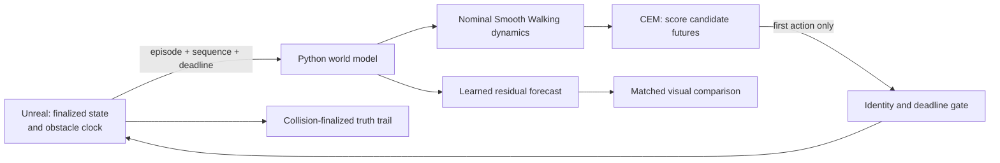

# MotionWorld — real-time world-model control in Unreal Engine

MotionWorld lets an Unreal character **imagine possible movement futures before acting**. A
lightweight state-space model rolls candidate actions forward, predicts two moving physical
obstacles on Unreal's authoritative clock, chooses a collision-aware route, executes only the first
action, and replans from what actually happened.

**Unreal Engine 5.8.2 · Python 3.12 · CEM model-predictive control · learned residual dynamics**

https://github.com/user-attachments/assets/3562aab2-9ae3-4cd1-9e84-4d688305f585

*Use the player controls to play, pause, scrub, adjust volume, or enter fullscreen.*

## What the demo shows

The character is not following a prerecorded path. At every control step it receives the latest
collision-finalized character state and both obstacles' synchronized motion state, evaluates 64
candidate action sequences, and selects a safe first move. It then observes Unreal again and repeats
the process.

| On screen | Meaning |
| --- | --- |
| Large red and smaller orange blocks | Two independently moving, physically collidable obstacles |
| Blue path | Nominal world-model forecast |
| Orange path | Learned residual forecast under the same selected actions |
| Yellow path | What Unreal actually executed after collision resolution |
| Green globe | Target and arrival zone |

The recording uses a synchronized retiming variant for the two obstacles. The accepted experiment
uses a frozen configuration so its result is reproducible.

## Accepted live result

In the canonical V3 run, the controller changed lateral direction around both obstacles, reported
`collision_count=0`, entered the 100 cm target zone, and stopped 85.06 cm from the target center.

| Evidence | Result |
| --- | ---: |
| Authoritative Unreal observations | 442 |
| Current, before-deadline actions admitted | 340 |
| Stale actions rejected | 83 |
| Missed responses | 101 |
| Safe-stop commands | 31 |
| Malformed packets / evidence drops | 0 / 0 |
| Python tests | 798 / 798 |
| Unreal `MotionWorld.*` automation tests | 20 / 20 |

The stale and missed responses are part of the result rather than hidden noise: obsolete actions are
never relabelled or applied. After bounded holds, the runtime commands zero velocity until a fresh
action is admitted.

## How it works



1. **Observe:** Unreal publishes the finalized character state, hidden Smooth Walking context,
   target, and two obstacle descriptions.
2. **Imagine:** the state-space model rolls candidate local-velocity actions 1.5 seconds into the
   future.
3. **Score:** swept collision and clearance costs evaluate both moving obstacle futures.
4. **Act:** CEM sends only the first action from the best sequence through a strict identity and
   100 ms deadline gate.
5. **Correct:** Unreal resolves movement and collision; the controller replans from that truth.

## Why this is a world model

This is a deliberately scoped **action-conditioned state-space world model**, not a pixel or video
generator. It predicts how the controllable character state will evolve under hypothetical actions
and combines that prediction with known obstacle dynamics. That makes thousands of counterfactual
future steps cheap enough to evaluate without cloning or pausing the Unreal world.

The hybrid model contains:

- a faithful analytic predictor for Unreal's Smooth Walking movement;
- a 106,886-parameter residual MLP trained on causal Unreal transitions;
- episode-safe feature history and train/validation separation;
- recursive rollout evaluation rather than teacher-forced-only reporting.

For the live V3 demo, **nominal MPC owns the actions**. The learned residual draws the orange
same-state, same-action forecast; it does not control the character. Offline evidence shows that the
residual changes predicted futures and planner choices, but the project does not claim a live
learned-controller victory.

## Engineering behind the demo

- A C++ Unreal plugin samples Mover state after simulation finalization instead of trusting requested
  input or rendered animation.
- Verified resets clear hidden movement state, episode identity, pending actions, visualization, and
  history before a new run.
- Every UDP action is bounded, finite, episode-matched, sequence-current, and received before an
  exclusive monotonic deadline.
- Physical collision is adjudicated by Unreal, not by the Python prediction.
- JSONL evidence, strict schemas, hashes, frozen configs, rejected attempts, and reversible Blueprint
  manifests make the result auditable.

The accepted and failed V3 runs are documented in
[DEMO-V3-001](docs/EXPERIMENT_LOG.md#demo-v3-001--two-obstacle-sequential-world-model-avoidance).

## Run the controller

Create the locked Python environment and run the test suite:

```bash
uv sync --frozen --python 3.12
uv run pytest
uv run ruff check .
```

After installing Epic's Game Animation Sample and deploying the source-controlled MotionWorld
plugin, start the canonical two-obstacle controller from this repository:

```bash
.venv/bin/python -m motionworld.control.service \
  --config configs/control_service_demo_nominal_mpc.yaml \
  --two-obstacle-config configs/live_two_obstacle_demo.yaml
```

Wait for `"health": "running"` and `"ready": true`, then press Play in Unreal. The complete
apply/record/restore workflow is in [V3_DEMO_RUNBOOK.md](docs/V3_DEMO_RUNBOOK.md). The optional
[retiming script](scripts/retime_v3_two_obstacle_demo_unreal.py) keeps Unreal and the randomized
planner configuration synchronized when demonstrating different obstacle speeds.

## Code map

- [`motionworld/planning/`](motionworld/planning/) — CEM, rollouts, and collision-aware costs
- [`motionworld/control/`](motionworld/control/) — live planning adapter and bounded UDP service
- [`motionworld/models/`](motionworld/models/) — residual features, training, and recursive rollout
- [`motionworld/protocol/`](motionworld/protocol/) — strict observations, actions, and transport
- [`unreal/Plugins/MotionWorld/`](unreal/Plugins/MotionWorld/) — Unreal authority, reset, networking,
  visualization, obstacle actors, and evidence capture
- [`artifacts/`](artifacts/) and [`evidence/`](evidence/) — frozen evaluations and live-run evidence
- [`docs/`](docs/) — specification, evidence, decisions, runbooks, checklists, and interview material

## Scope and licensing

The live result establishes collision-aware world-model MPC around **exactly two reproducible
analytic moving obstacles**. It does not establish visual perception, arbitrary-scene navigation,
learned obstacle dynamics, reinforcement learning, or learned-control superiority.

This repository contains project-specific source, configurations, derived artifacts, and evidence.
Epic's licensed Unreal Engine and Game Animation Sample assets are intentionally excluded and must
be obtained separately through Epic.
