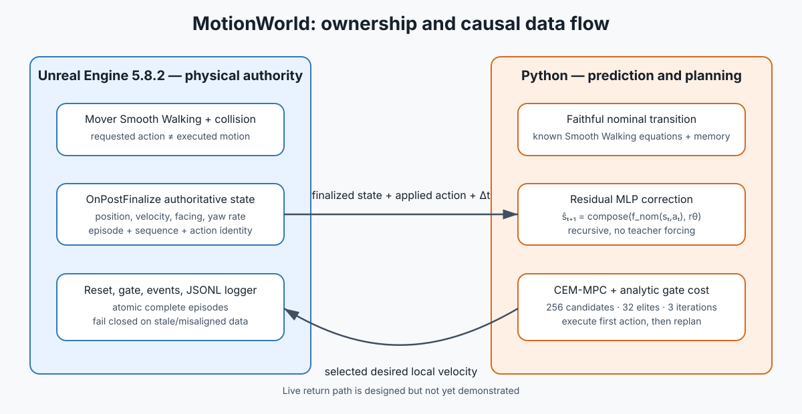

# MotionWorld interview package

## The result in one sentence

I built and validated the first three links of an action-conditioned residual-world-model pipeline—
Unreal state capture, held-out recursive prediction, and fair offline action selection—but I did
not complete the decisive live-control comparison, and the residual planner currently fails its
10 Hz runtime gate.

## Evidence ladder

| Link | Question | Evidence | Status |
|---|---|---|---|
| 1 | Is the nominal model wrong in a causal planning setting? | Held-parameter recursive validation exposes parameter-transition error. | Demonstrated on validation |
| 2 | Does the residual predict that error? | No-history residual improves p95 error at 0.5/1.0/1.5 s without teacher forcing. | Demonstrated on validation |
| 3 | Does it change the planner's decision fairly? | Common initial candidates/config; first actions differ in OFFPLAN-001. | Demonstrated offline |
| 4 | Does that action improve the same-seed Unreal outcome? | Requires live paired execution. | **Not demonstrated** |

## Architecture



Unreal owns authoritative movement, collision, reset, and finalized state. Python owns episode
validation, the faithful nominal predictor, residual inference, analytic gate cost, and CEM. The
model sees state, action, timestep, known nominal context, and the nominal proposal; it does not see
future event schedules or final-test outcomes.

## Central validation results

### Recursive prediction: all common validation windows, p95

| Horizon | Model | Position cm | Velocity cm/s | Yaw deg | Yaw rate deg/s |
|---:|---|---:|---:|---:|---:|
| 0.5 s | Nominal | 16.719 | 64.394 | 46.156 | 292.599 |
| 0.5 s | Residual | 14.395 | 57.483 | 20.151 | 102.550 |
| 1.0 s | Nominal | 30.222 | 61.151 | 97.287 | 441.489 |
| 1.0 s | Residual | 27.934 | 55.206 | 30.691 | 75.100 |
| 1.5 s | Nominal | 31.229 | 66.629 | 52.302 | 361.373 |
| 1.5 s | Residual | 28.964 | 58.557 | 11.583 | 66.670 |

Source: [recursive comparison](../artifacts/residual/recursive_001/README.md). These validation
episodes come from the same scripted family as training and contain no collisions or random pushes.

### Fair offline planning

| Controller model | First local velocity action (cm/s) | Own-model predicted cost |
|---|---:|---:|
| Nominal | `[40.192, -139.872]` | 106.476 |
| Residual | `[23.420, -102.090]` | 86.081 |

The first CEM population is byte-identical and every fairness-critical setting is shared. The
models strongly disagree under cross-evaluation: the residual model predicts the nominal-selected
plan collides, while the nominal model rates the residual-selected plan poorly. That proves
decision relevance and simultaneously exposes model-exploitation risk. It is not a control result.

### Runtime

| Controller | Median ms | p95 ms | Misses / 30 | 100 ms gate |
|---|---:|---:|---:|:---:|
| Nominal MPC | 70.709 | 81.549 | 0 | Pass |
| Residual MPC | 149.655 | 169.401 | 30 | **Fail** |

Two prospective repair attempts were rejected rather than post-hoc tuned: no reduced CEM budget
passed both runtime and search-quality gates, and no smaller MLP passed recursive, cross-planning,
and runtime gates together.

## Strongest and weakest claims

Strongest supported claim: a causally logged, episode-safe Unreal dataset can train a residual MLP
that improves bounded held-out recursive prediction and materially changes a fair offline CEM plan.

Weakest honest overall conclusion: the prototype does **not** yet show improved Unreal control.
It needs a transport-safe live loop, a planner that meets its deadline, frozen paired scenario
execution, and final-test statistics.

## Visual evidence sequence

1. [Architecture](../artifacts/interview/architecture.svg)
2. [Recursive prediction graph](../artifacts/residual/recursive_001/recursive_comparison.png)
3. [Offline paired planner](../artifacts/planning/offplan_001/offline_paired_planner.png)
4. [Full-planner latency](../artifacts/planning/runtime_001/README.md)
5. [Rejected CEM budgets](../artifacts/planning/budget_sweep_001/budget_sweep.png)
6. [Rejected smaller models](../artifacts/residual/compression_001/width_sweep.png)

## Reproduce the package checks

```bash
uv sync --frozen --python 3.12
uv run pytest
uv run ruff check .
uv run python scripts/verify_interview_package.py
```

Unreal runtime evidence additionally requires UE 5.8.2 and a separately acquired Game Animation
Sample. Raw episode captures are intentionally not distributed in this repository.
